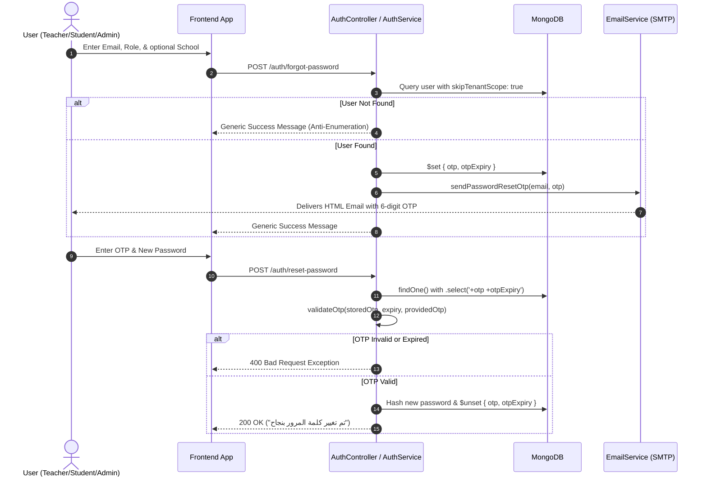

# Nasaq School System — OTP (One-Time Password) Feature Documentation

> **Version:** 2.0  
> **Module:** Authentication & Student Portal  
> **Last Updated:** 2026-08-11  

---

## 1. Executive Summary

The **One-Time Password (OTP)** feature in Nasaq School System provides a secure, email-driven mechanism for:
1. **Password Recovery / Forgot Password**: Available to all system roles (`TEACHER`, `STUDENT`, `OWNER`, `MANAGER`, `SUPERVISOR`).
2. **Student First-Time Portal Setup**: Allows newly created student profiles to set up their portal password via email verification.

---

## 2. Technical Architecture & Security Safeguards

### 🔒 Key Security Specifications

| Specification | Details |
|---|---|
| **OTP Format** | 6-digit numeric string generated via `Math.floor(100000 + Math.random() * 900000).toString()` |
| **Expiration Window** | **15 Minutes** (`Date.now() + 15 * 60 * 1000`) |
| **Schema Security** | `otp` and `otpExpiry` fields are marked `{ select: false }` across `Admin`, `Teacher`, and `Student` schemas to prevent accidental data leakage in standard queries |
| **One-Time Usage** | OTP fields are removed via `$unset` or cleared to `undefined` immediately upon successful password reset |
| **Email Enumeration Defense** | The `/auth/forgot-password` endpoint always returns a uniform generic success message, preventing attackers from discovering registered email addresses |
| **Cross-Tenant Scope Bypass** | Database queries use `skipTenantScope: true` so users can request and reset passwords without needing an active tenant JWT |

---

## 3. Workflows & Sequence Diagrams

### 🔄 Forgot Password Flow (All Roles)



---

## 4. API Endpoints Reference

### 4.1 Global Auth Endpoints (`/auth`)

#### `POST /auth/forgot-password` 🔓
Requests a 6-digit OTP sent to the user's registered email.

- **URL:** `/auth/forgot-password`
- **Method:** `POST`
- **Authentication:** None (Public 🔓)
- **Request Body (`ForgotPasswordDto`):**
  ```json
  {
    "email": "teacher@school.com",
    "role": "TEACHER",
    "schoolSlug": "main-school"
  }
  ```

| Field | Type | Required | Description |
|---|---|---|---|
| `email` | `string` | ✅ | Registered user email address |
| `role` | `string` | ✅ | User role: `'TEACHER'` \| `'STUDENT'` \| `'OWNER'` \| `'MANAGER'` \| `'SUPERVISOR'` |
| `schoolSlug` | `string` | ❌ | School slug (optional - used to narrow down duplicate emails across schools) |
| `schoolId` | `string` | ❌ | Direct School MongoID (optional) |

- **Response (`200 OK`):**
  ```json
  {
    "message": "إذا كان البريد الإلكتروني مسجلاً، سيتم إرسال رمز التحقق إليه خلال لحظات"
  }
  ```

---

#### `POST /auth/reset-password` 🔓
Validates OTP code and updates the account password.

- **URL:** `/auth/reset-password`
- **Method:** `POST`
- **Authentication:** None (Public 🔓)
- **Request Body (`ResetPasswordDto`):**
  ```json
  {
    "email": "teacher@school.com",
    "role": "TEACHER",
    "otp": "482910",
    "newPassword": "NewSecurePassword@123",
    "schoolSlug": "main-school"
  }
  ```

| Field | Type | Required | Rules & Description |
|---|---|---|---|
| `email` | `string` | ✅ | Registered user email address |
| `role` | `string` | ✅ | User role: `'TEACHER'` \| `'STUDENT'` \| `'OWNER'` \| `'MANAGER'` \| `'SUPERVISOR'` |
| `otp` | `string` | ✅ | 6-digit OTP code received in email |
| `newPassword` | `string` | ✅ | New password (minimum 6 characters) |
| `schoolSlug` | `string` | ❌ | School slug (optional) |
| `schoolId` | `string` | ❌ | Direct School MongoID (optional) |

- **Response (`200 OK`):**
  ```json
  {
    "message": "تم تغيير كلمة المرور بنجاح، يمكنك تسجيل الدخول الآن"
  }
  ```

- **Error Responses:**
  - `400 Bad Request`: `"يرجى طلب رمز التحقق أولاً"` (No OTP requested)
  - `400 Bad Request`: `"انتهت صلاحية رمز التحقق، يرجى طلب رمز جديد"` (OTP > 15 mins old)
  - `400 Bad Request`: `"رمز التحقق غير صحيح"` (Incorrect OTP code)
  - `404 Not Found`: `"البريد الإلكتروني غير مسجل"` (Invalid email)

---

### 4.2 Student Portal Endpoints (`/students`)

#### `POST /students/request-password-setup` 🔓
Request 6-digit OTP for student portal activation or password reset.

- **URL:** `/students/request-password-setup`
- **Method:** `POST`
- **Authentication:** None (Public 🔓)
- **Request Body (`RequestPasswordSetupDto`):**
  ```json
  {
    "email": "student@school.com"
  }
  ```

- **Response (`200 OK`):**
  ```json
  {
    "message": "تم إرسال رمز التحقق إلى بريدك الإلكتروني"
  }
  ```

---

#### `POST /students/set-password` 🔓
Set or reset student portal password using OTP.

- **URL:** `/students/set-password`
- **Method:** `POST`
- **Authentication:** None (Public 🔓)
- **Request Body (`SetPasswordDto`):**
  ```json
  {
    "email": "student@school.com",
    "otp": "123456",
    "password": "NewStudentPassword123"
  }
  ```

- **Response (`200 OK`):**
  ```json
  {
    "message": "تم تعيين كلمة المرور بنجاح، يمكنك تسجيل الدخول الآن"
  }
  ```

---

## 5. Email Service Configuration

The email notification component is handled by [`EmailService`](file:///d:/Work/Aura/nasaq-backend/src/email/email.service.ts) using `Nodemailer`.

### Template Features
- **RTL Support**: Tailored Arabic styling (`direction: rtl`).
- **Responsive Card Design**: Clean layout with clear 6-digit code box.
- **Expiration Notice**: Highlights 15-minute expiration timeframe.

---

## 6. Automated Testing & Verification

Unit test suites exist to verify OTP generation, storage, validation, expiration, and exception handling.

### Running OTP Unit Tests
Run the following command in the terminal:

```bash
npx jest src/auth/auth-otp.spec.ts src/students/students-otp.spec.ts
```

### Test Coverage Highlights
- ✅ **OTP Generation**: Validates creation of 6-digit numeric string and 15-min expiry timestamp.
- ✅ **Email Dispatch**: Verifies `EmailService.sendPasswordResetOtp` is invoked with correct recipient and OTP.
- ✅ **Anti-Enumeration**: Verifies non-existent email requests do not leak account existence.
- ✅ **Validation Guard**: Verifies `validateOtp` correctly accepts matching codes and rejects invalid or expired codes.
- ✅ **Cleanup**: Verifies `otp` and `otpExpiry` are removed from DB upon completion.
